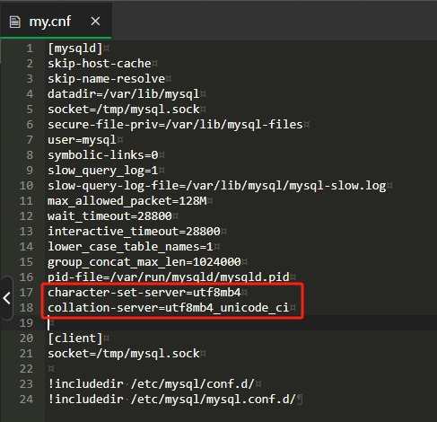

# FAQ

1. Docker 版 MySQL 会出现无数据的情况，详情见：[Issues](https://github.com/HackAllSec/XuanQiong/issues/2)。1.0.8版本已修复此问题。
解决方法：
- 找到容器的配置文件，添加以下内容：
  ```
  [mysqld]
  character-set-server=utf8mb4
  collation-server=utf8mb4_unicode_ci
  ```
  

2. 发生 `Error creating database: Error 1044 (42000): Access denied for user` 说明当前数据库用户无法创建数据库，需要使用高权限用户创建 `config.yaml` 中 `database -> connection -> name` 对应的数据库。
3. 首次启动没有显示用户名和密码，请检查数据库 `xq_users` 表中是否有管理员角色账户，只有表中无管理员角色账户时才会生成 `admin` 账户和密码。
